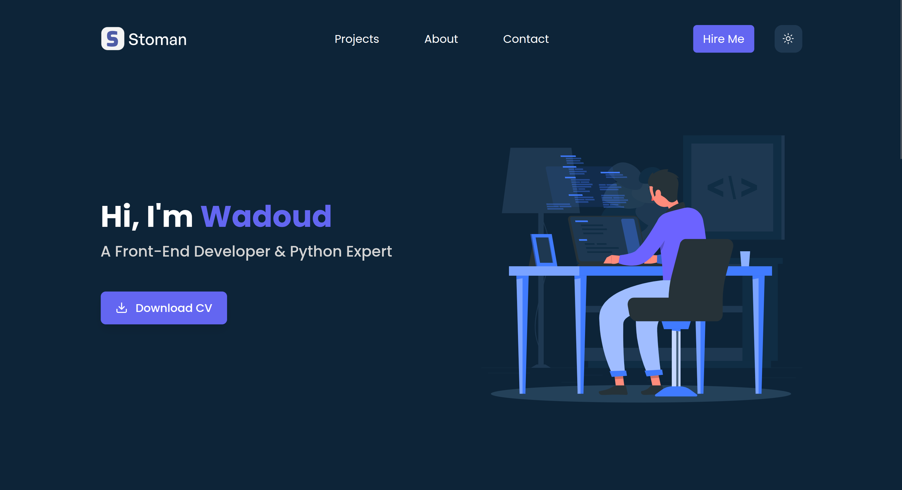
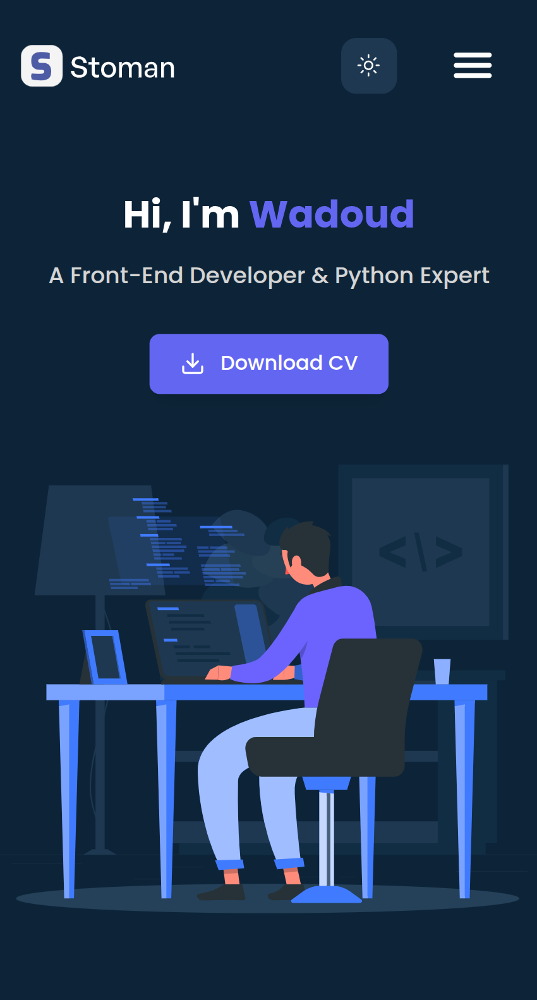

# Portfolio Website

A modern, responsive portfolio website built with React and Tailwind CSS, featuring a sleek dark/light theme toggle and smooth animations.

## 🖼️ Screenshots

| Desktop View | Mobile View |
|-------------|------------|
|  |  |

## ✨ Features

- 🎨 **Dark/Light Theme** - Seamless theme switching with persistent preferences
- 📱 **Fully Responsive** - Optimized for all devices (mobile, tablet, desktop)
- ⚡ **Fast Performance** - Built with Vite for lightning-fast development and production builds
- 🎭 **Smooth Animations** - Engaging transitions and hover effects
- 📊 **Animated Statistics** - Counter animations with intersection observer
- 🔗 **Multi-page Routing** - Client-side routing with React Router
- 🎯 **SEO Friendly** - Semantic HTML and proper meta tags
- ♿ **Accessible** - WCAG compliant with proper ARIA labels

## 🚀 Tech Stack

- **Frontend Framework:** React 19
- **Styling:** Tailwind CSS v4
- **Routing:** React Router v6
- **Build Tool:** Vite
- **Icons:** Lucide React
- **Analytics:** Google Analytics 4 (optional)

## 📦 Installation

1. **Clone the repository**
```bash
git clone https://github.com/Wadoud-ME/First-Portfolio-with-React
cd First-Portfolio-with-React
```

2. **Install dependencies**
```bash
npm install
```

3. **Start development server**
```bash
npm run dev
```

4. **Build for production**
```bash
npm run build
```

5. **Preview production build**
```bash
npm run preview
```

## 🗂️ Project Structure
```
portfolio/
├── public/
│   └── cv.pdf                    # Your CV/Resume file
├── src/
│   ├── assets/
│   │   ├── images/               # Images and logos
│   │   └── *.svg                 # Icon files
│   ├── components/
│   │   ├── HEADER/
│   │   │   ├── Header.jsx
│   │   │   ├── Logo.jsx
│   │   │   ├── Navigation.jsx
│   │   │   ├── ThemeToggle.jsx
│   │   │   └── MobileMenu.jsx
│   │   ├── PROFILE/
│   │   │   ├── ProfileIntro.jsx
│   │   │   ├── Stats.jsx
│   │   │   └── Brands.jsx
│   │   ├── UI/
│   │   │   └── Button.jsx
│   │   ├── Hero.jsx
│   │   └── Footer.jsx
│   ├── context/
│   │   ├── ThemeContext.jsx
│   │   └── ThemeProvider.jsx
│   ├── data/
│   │   ├── brands.js             # Brand logos data
│   │   └── socialLinks.js        # Social media links
│   ├── hooks/
│   │   └── useTheme.js           # Custom theme hook
│   ├── pages/
│   │   ├── Home.jsx
│   │   ├── About.jsx
│   │   └── Rout.jsx              # Layout wrapper
│   ├── routes/
│   │   └── index.jsx             # Route configuration
│   ├── utils/
│   │   └── analytics.js          # Analytics setup (optional)
│   ├── App.jsx
│   ├── main.jsx
│   └── index.css                 # Tailwind & custom styles
├── .gitignore
├── package.json
├── tailwind.config.js
├── vite.config.js
└── README.md
```

## 🎨 Customization

### Update Personal Information

1. **Hero Section** - Edit `src/components/Hero.jsx`
2. **About Me** - Edit `src/components/PROFILE/ProfileIntro.jsx`
3. **Statistics** - Edit `src/components/PROFILE/Stats.jsx`
4. **Social Links** - Edit `src/data/socialLinks.js`
5. **CV/Resume** - Replace `public/cv.pdf` with your file

### Theme Colors

Customize colors in `src/index.css`:
```css
@theme {
  /* Light theme colors */
  --color-primary: #1e3851;
  --color-secondary: #6b7280;
  --color-bg-primary: #fff;
  --color-bg-secondary: #6366f1;
  --color-bg-buttons: #f7f8fc;
}

@layer base {
  .dark {
    /* Dark theme colors */
    --color-primary: #fff;
    --color-secondary: #d4d4d4;
    --color-bg-primary: #0d2438;
    --color-bg-buttons: #1e3851;
  }
}
```

### Add Google Analytics (Optional)

1. Install dependency:
```bash
npm install react-ga4
```

2. Create `src/utils/analytics.js`:
```javascript
import ReactGA from "react-ga4";

export const initGA = () => {
  ReactGA.initialize("G-XXXXXXXXXX"); // Your GA4 Measurement ID
};

export const trackDownload = (fileName) => {
  ReactGA.event({
    category: "Download",
    action: "CV Download",
    label: fileName,
  });
};
```

3. Initialize in `App.jsx`

## 📱 Responsive Breakpoints

- **Mobile:** < 640px
- **Small (sm):** ≥ 640px
- **Medium (md):** ≥ 768px
- **Large (lg):** ≥ 1024px
- **Extra Large (xl):** ≥ 1280px
- **2XL:** ≥ 1536px

## 🌐 Deployment

### Deploy to Netlify

[](https://simple-portfolio23.netlify.app/)

### Manual Deployment

1. Build the project:
```bash
npm run build
```

2. Deploy the `dist` folder to your hosting service

## 🤝 Contributing

Contributions, issues, and feature requests are welcome!

1. Fork the project
2. Create your feature branch (`git checkout -b feature/AmazingFeature`)
3. Commit your changes (`git commit -m 'Add some AmazingFeature'`)
4. Push to the branch (`git push origin feature/AmazingFeature`)
5. Open a Pull Request

## 📝 License

This project is [MIT](./LICENSE) licensed.

## 👤 Author

**Wadoud**

- GitHub: [@Wadoud-Me](https://github.com/Wadoud-Me)

## ⭐ Show your support

Give a ⭐️ if you like this project!

## 🙏 Acknowledgments

- Design inspiration from modern portfolio websites
- Icons from [Lucide Icons](https://lucide.dev/)
- Built with [Vite](https://vitejs.dev/)
- Styled with [Tailwind CSS](https://tailwindcss.com/)

---

Made with ❤️ by Wadoud